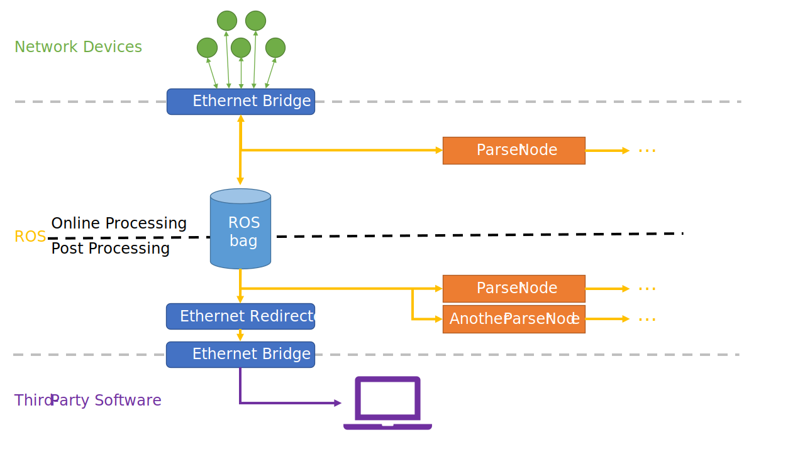
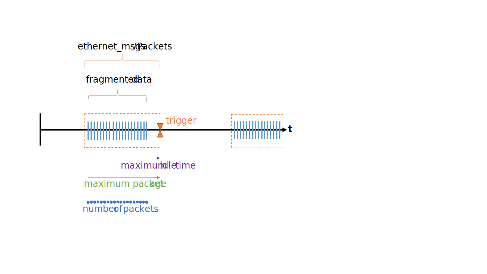

# ethernet_bridge
## _Ethernet Bridge for ROS_

`ethernet_bridge` is a set of ROS nodes to bridge network interfaces from and to the ROS message definitions [`ethernet_msgs`](ethernet_msgs/). The Ethernet bridge can be used to insert network abstraction layers in ROS processing chains and to separate Ethernet interfaces from parser nodes. As Ethernet data is usually compressed, it is conceivable to store raw Ethernet data in ROS bags instead of processed or parsed device data. By this means, the size of ROS bags is kept minimal while providing a longterm-stable, generic data interface.



## Advantages of an Ethernet data layer

- Ethernet data is usually compressed raw data and perfectly suited to be stored in ROS bags
- Generic and longterm-stable: ROS bags with Ethernet data can be processed with any kind of (future) parser
- A ROS bag with Ethernet raw data is comparable to a pcap file; the Ethernet packets can be re-sent over the network to feed applications without ROS interface
- High reusability: parsers can be bugfixed and extended without the need of re-recording data (in contrast to storing processed data)
- Multiple concurrent nodes can process a data stream simultaneously

## Features

- Low additional ROS overhead (the standard UDP node is suitable to abstract 128-diode laser scanners with ~6000 UDP packets per second, ~8 MBytes/s with < 5% CPU overhead)
- All bridges support bidrectional online transfers
- Each packet contains the ports and IPs of sender and receiver
- Event messaging (e.g. TCP connection established signal)
- Tested for various applications and devices (Lidar scanners, Radar sensors, INS)
- We avoid any further modifications on our existing `ethernet_msgs` to ensure longterm bag capability
- No additional system dependencies, uses only standard ROS desktop dependencies (Qt)

## Currently available bridges
- UDP node
- UDP bundler node which bundles UDP packets of a burst (e.g. fragmented sensor measurement) and thereby drastically reduces the number of ROS messages
- TCP client node
- Packet redirecting node, can be used to send Ethernet messages from a ROS bag to the local network with modified recipients

## ROS Package Dependencies

- `librosqt` (only needed for the bridging nodes)

## Nodes Description
### _udp_: Standard UDP Bridge
This is the standard bridge for UDP communication and focuses on most application use cases except of transfers with a very high packet load.

#### Options

- `topic_*`: ROS topic specific configuration segment
  - `topic_busToHost`: ROS topic which receives Ethernet packets (published by bridge)
  - `topic_hostToBus`: ROS topic which sends Ethernet packets (subscribed by bridge)
  - `topic_event`: ROS topic providing communication events (published by bridge)
- `ethernet_*`: Ethernet interface specific configuration segment
  - `ethernet_bindAddress`: specific local IP bind address (optional)
  - `ethernet_bindPort`: local listening port

#### Application Example

This is an extract of a launch file for a BroadR-Reach-based radar sensor network with multiple devices for both bidirectional point-to-point and broadcast communication:
```
  <!-- Node parameters -->
  <arg name="topic_ethernet"        default="/bus/ethernet/umrr/udp55555" />
  <arg name="ethernet_ip"           default="0.0.0.0" />
  <arg name="ethernet_port"         default="55555" />
  
  <!-- Ethernet bridge node -->
  <node pkg="ethernet_bridge" type="udp" name="udp">
    <param name="topic_busToHost"       value="$(arg topic_ethernet)/bus_to_host" />
    <param name="topic_hostToBus"       value="$(arg topic_ethernet)/host_to_bus" />
    <param name="topic_event"           value="$(arg topic_ethernet)/event" />
    <param name="ethernet_bindAddress"  value="$(arg ethernet_ip)" />
    <param name="ethernet_bindPort"     value="$(arg ethernet_port)" />
  </node>
```

### _udp_bundler_: UDP Bundler Bridge
Similar to the standard UDP node, but bundles UDP packets of a burst. It significantly reduces the number of ROS messages to transfer fragmented data like camera measurements.
Three parameters trigger the sending of the currently collected UDP packets as a list in a single message (`ethernet_msgs/Packets`) over ROS:

- _Number of Packets_: when the number of currently collected UDP packets exceeds this parameter, the collection is sent. Default: 50.
- _Maximum Packet Age_: as soon as the oldest collected UDP packet (= the first obtained one of the current collection) exceeds this parameter, the collection is sent. Default: 10ms.
- _Maximum Idle Time_: when no further packet has been received in this time, the current collection is sent. Default: 2ms.

Depending on the choice of these parameters, an additional latency is introduced. Typically, the actual processing latency of fragmented data in a burst depends only from _Maximum Idle Time_. This parmeter can be set to 1ms or 2ms to achieve a very good compromise between additional latency and burst bundling performance.



#### Options

- `topic_*`: ROS topic specific configuration segment
  - `topic_busToHost`: ROS topic which receives Ethernet packets (published by bridge)
  - `topic_hostToBus`: ROS topic which sends Ethernet packets (subscribed by bridge)
  - `topic_event`: ROS topic providing communication events (published by bridge)
- `ethernet_*`: Ethernet interface specific configuration segment
  - `ethernet_bindAddress`: specific local IP bind address (optional)
  - `ethernet_bindPort`: local listening port
- `trigger_*`: Trigger specific configuration segment
  - `trigger_numberOfPackets`: parameter _Number of Packets_
  - `trigger_maximumPacketAge`: parameter _Maximum Packet Age_ in milliseconds
  - `trigger_maximumIdleTime`: parameter _Maximum Idle Time_ in milliseconds

#### Application Example

similar to the standard UDP node _udp_.

### _tcp_client_: TCP Client Bridge
This bridge acts as a TCP client socket. It can be configured to periodically reconnect on connection loss and use a custom buffer size to control the data flow latency.
The TCP client bridge publishes the current connection state for monitoring purposes.

#### Options

- `topic_*`: ROS topic specific configuration segment
  - `topic_busToHost`: ROS topic which receives Ethernet packets (published by bridge)
  - `topic_hostToBus`: ROS topic which sends Ethernet packets (subscribed by bridge)
  - `topic_event`: ROS topic providing communication events (published by bridge)
- `ethernet_*`: Ethernet interface specific configuration segment
  - `ethernet_peerAddress`: TCP server address
  - `ethernet_peerPort`: TCP server port
  - `ethernet_bufferSize`: custom buffer size in bytes. Use 0 for system default. Default: 0.
  - `ethernet_reconnectInterval`: Auto-reconnect (on connection loss) interval in milliseconds. Use 0 to deactivate. Default: 500ms.

#### Application Example

```
  <!-- Node parameters -->
  <arg name="topic_ethernet"        default="/bus/ethernet/your_device/tcp55555" />
  <arg name="ethernet_ip"           default="192.168.77.1" />
  <arg name="ethernet_port"         default="55555" />
  
  <!-- Ethernet bridge node -->
  <node pkg="ethernet_bridge" type="udp" name="udp">
    <param name="topic_busToHost"       value="$(arg topic_ethernet)/bus_to_host" />
    <param name="topic_hostToBus"       value="$(arg topic_ethernet)/host_to_bus" />
    <param name="topic_event"           value="$(arg topic_ethernet)/event" />
    <param name="ethernet_peerAddress"  value="$(arg ethernet_ip)" />
    <param name="ethernet_peerPort"     value="$(arg ethernet_port)" />
  </node>
```

### _redirector_: Packet Redirecting Node
This packet can be used to change the recipients IP and port of `ethernet_msgs/Packet` in ROS on-the-fly. Its main use case is to read Ethernet packets from a ROS bag, altering their recipients, and passing them to a Ethernet bridge like `ethernet_bridge/udp`. This way, it can be used to re-inject Ethernet packets from a bag to the network and allow other parsers or proprietary manufacturer software to process the Ethernet data in the bag.

#### Options

- `topic_*`: ROS topic specific configuration segment
  - `topic_in`: ROS topic with the original messages (subscribed)
  - `topic_out`: ROS topic with the modified messages (published)
- `redirect_*`: Redirecting specific configuration segment
  - `redirect_address`: new IP or host address of recipient. Use "" if redirecting the IP is not desired.
  - `redirect_port`: new port of recipient. Use 0 if redirecting the port is not desired.

#### Application Example

```
  <!-- Redirector node -->
  <node pkg="ethernet_bridge" type="redirector" name="redirector">
    <param name="topic_in"          value="source/bus_to_host" />
    <param name="topic_out"         value="target/host_to_bus" />
    <param name="redirect_address"  value="192.168.1.123" />
    <param name="redirect_port"     value="0" />
  </node>
```

## Benchmarks
The following benchmarks denote the CPU overhead caused by using the Ethernet abstraction between Ethernet interface and parser nodes. The overhead has been computed by subtracting the CPU load of a) the Ethernet bridge plus b) the receiving node from the CPU load of a comparable receiving node which receives the Ethernet data directly (i.e. a traditional parser).

| Load                                        | Application Example         | `udp`                 | `udp_bundler`       |
|---------------------------------------------|-----------------------------|-----------------------|---------------------|
| BW 5MBit/s, Rate 100Hz, MTU 1500Bytes       | INS, Radar Network          | <0,5% CPU (4% core)   | <0,5% CPU (4% core) |
| BW ~7,7MByte/s, Bursts 100Hz, MTU 1500Bytes | High-res LiDAR scanners     | 2,8% CPU (22% core)   | 0,8% CPU (6% core)  |
| BW ~75MByte/s, Bursts 100Hz, MTU 9000Bytes  | Camera                      | 4,9% CPU (39% core)   | 1,1% CPU (9% core)  |
| BW ~75MByte/s, Bursts 100Hz, MTU 1500Bytes  | Camera without Jumbo Frames | >100% core RIP        | 1,1% CPU (9% core)  |
| BW ~175MByte/s, Bursts 500Hz, MTU 9000Bytes | Dummy data generator (test) | -                     | 1,6% CPU (13% core) |

The results of the `udp` node show that the CPU overhead is mainly caused by the number of messages per second, and barely caused by the size of the messages or the message bandwidth itself. This is exactly where the `udp_bundler` steps in: it bundles the Ethernet packets and significantly reduces the number of messages which are transferred over the ROS network.
As a result, the `udp` node can be used for any type of network device as long as the number of Ethernet packets is below ~10kHz (considering the given computer system).
The benchmarks have been measured with an i7-4790k CPU from 2014. All ROS nodes dealing with the `ethernet_msgs` run on the same machine and benefit from the loopback implementations.

## Contributions

We look forward to contributions to `ethernet_bridge` and `ethernet_msgs`. Please note that modifications on existing `ethernet_msgs` definitions would impair longterm stability and are avoided.
